# Core foundation of  Gen Ai

```mermaid
---
config:
  theme: redux
  layout: dagre
  look: classic
---
flowchart LR
    A["Raw Text<br/>'The dog chased the cat because it was fast.'"] -- Tokenization --> B["Tokens<br/>['The', 'dog', 'chased', ...]"]
    B -- Encoding --> C["Token IDs<br/>[10, 23, 45, ...]"]
    C -- Embedding --> D["Dense Vectors<br/>e.g. 'cat': [0.18, -0.60, ...]"]
    D -- PositionalEncoding --> E["+ Positional Info<br/>e.g. 'dog' @ pos 1, 'cat' @ pos 4"]
    E -- MultiHeadSelfAttention --> F["Self Attention<br/>Each token context from all others"]
    F -- FFN --> G["Feed-Forward Network<br/>Feature mixing & nonlinearity"]
    G -- Linear --> H["Logits<br/>Dense vector per token<br/>e.g. [0.12, -0.76, ..., 1.23]"]
    H -- Softmax --> I["Probabilities<br/>List over vocab<br/>e.g. ['cat': 0.63, 'dog': 0.02, 'because': 0.01, ...]"]
    I -- "Sample/Argmax" --> J["Final Output<br/>e.g. Next word is 'because' (highest probability)"]

    A@{ shape: rounded}
    B@{ shape: rounded}
    C@{ shape: rounded}
    D@{ shape: rounded}
    E@{ shape: rounded}
    F@{ shape: rounded}
    G@{ shape: rounded}
    H@{ shape: rounded}
    I@{ shape: rounded}
    J@{ shape: rounded}

```

| Step               | Why?                                                                 | Problem Solved                                                                 | How?                                                                 |
|--------------------|----------------------------------------------------------------------|-------------------------------------------------------------------------------|-----------------------------------------------------------------------|
| Tokenization      | Structure raw text                                                   | Unmanageable input                                                            | Splitting/tokenization                                               |
| Encoding          | Make tokens numerical                                                 | Model needs numbers                                                          | Integer/one-hot encoding                                            |
| Embedding          | Add context & meaning                                                | Sparse & meaningless codes                                                    | NN embedding layer                                                   |
| Positional Encoding| Add order/sequence awareness                                         | No sense of order                                                             | Add/concat position vecs                                              |
| Model Processing   | Read relationships/predict                                            | Extract info & outputs                                                       | Attention/transformer                                                |

1. **Tokenization**
    - **what?** 
     The process of converting a piece of data into a token, which is a nonsensitive substitute for the original information
   - **Why?**
     Raw text is unstructured; models can't process plain text.
   - **Problem Solved:**
     Breaks sentences and documents into manageable units (tokens), enabling models to work piecewise.
   - **How?**
     using the tokenizer to split text into tokens based on spaces, punctuation, or subword units.
   - various tokenization methods:
     - Word-level: Splits by spaces/punctuation ("I love AI!" → ["I", "love", "AI", "!"])
     - Subword-level: Breaks words into smaller units (e.g., "unhappy" → ["un", "happy"])
     - Character-level: Each character is a token ("AI" → ["A", "I"])
   - **Output**: A list of tokens.
     **Example**: "I love AI!" → ["I", "love", "AI", "!"]

2. **Encoding**
   - **What?**
    The process of converting raw data like text, images, or sound into a numerical format that a machine learning model can understand
   - **Why?**
     Models process numbers, not text.
   - **Problem Solved:**
     Converts tokens to numeric form for model input.
   - **How?**
     - Integer encoding: Each token mapped to an index ("AI" → 33).
     - One-hot encoding: Vector of zeros with a single one at the token’s index.
     - Sparse, does not capture meaning or similarity.
    - **Output**: A list/array of token IDs.
     **Example**: ["I", "love", "AI", "!"] → [5, 12, 33, 2]

3. **Embedding**
   - **What?**
    The process of transforming categorical data, such as words or tokens, into continuous vector representations that capture semantic meaning and relationships between the data points.
   - **Why?**
     - Encodings (integers, one-hot) ignore relationships/similarity. 
      - Need rich, dense numeric representation with semantic meaning.
   - **Problem Solved:**
     Captures context, meaning, and similarity between tokens for advanced modeling.
   - **How?**
     Embedding layer (NN) maps token IDs to high-dimensional, dense vectors ([0.19, -0.80, ...]).
     Vectors learned from data; similar words have close vectors.
    - **Output**: Dense vector representations.
     **Example**: [5, 12, 33, 2] → [[0.21, -0.8, ...], [0.9, 0.03, ...], ...]
     - [Animation for better understanding of embeddings]( https://www.youtube.com/embed/lPTcTh5sRug?si=VQkRZIhqg68G16p3)

4. **Positional Encoding**
   - **What?**
    The process of adding information about the position or order of tokens in a sequence to their vector representations.
   - **Why?**
     Embedding provides meaning, but ignores token order.
     Order is essential in language interpretation.
   - **Problem Solved:**
     Injects sequence/order info so that models understand the difference between “cat sat” and “sat cat”.
   - **How?**
     - Sinusoidal encoding: Computes unique vectors per position using sine/cosine functions.
     - Learnable encoding: Position vectors learned during model training.
     - Added or concatenated to token embeddings before attention/model layers.
    - **Output**: Vectors with position info.
     **Example**: [[0.21, -0.8, ...], ...]
      + Positional Encoding → [[...]+PE], ...

5. **Self attention**
    - **What?**
      A mechanism that allows models to weigh the importance of different tokens in a sequence relative to each other when processing input data.
  - **Why?**

5. **Model Processing (Attention, etc.)**
   - **Why?**
     Need to capture complex dependencies, context, and generate predictions/outputs.
   - **Problem Solved:**
     Models “read” contextualized vectors to learn relationships and perform tasks (translation, classification, text generation).
   - **How?**
     - Attention mechanisms: Compare/weight all tokens for context.
     - Transformer layers: Compose and transform vector info through deep architectures.

### 🔑 Developer Takeaways

- **Tokenization** = making unstructured text manageable.
- **Encoding** = giving every token a unique numeric identity.
- **Embedding** = mapping tokens to meaningful, dense vectors.
- **Positional encoding** = injecting order awareness.
- **Model processing** = learning dependencies for smart predictions.

