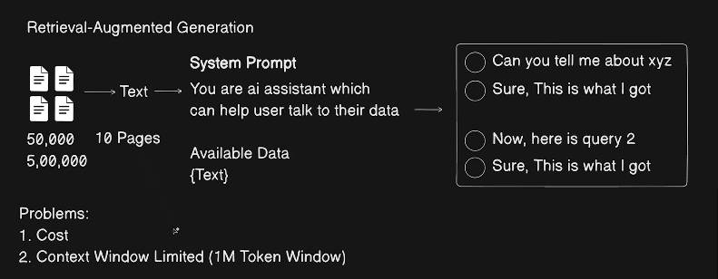
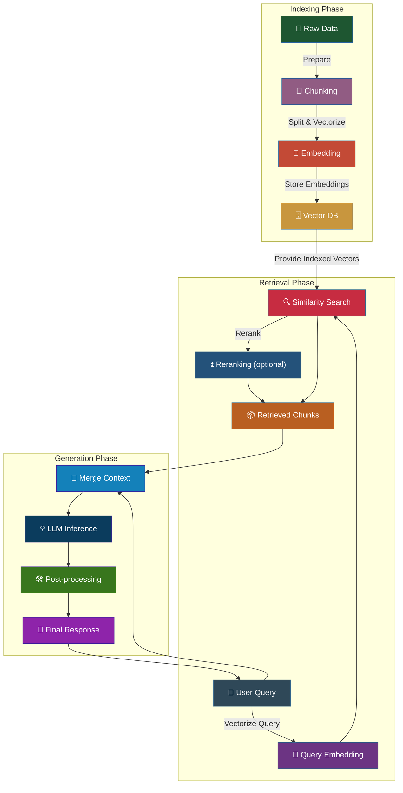
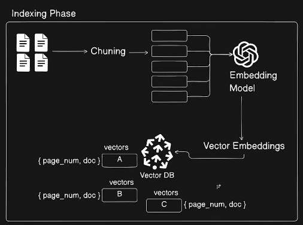
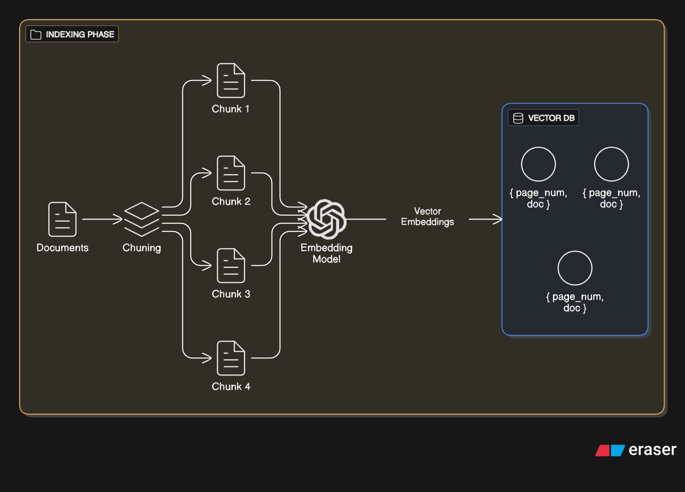
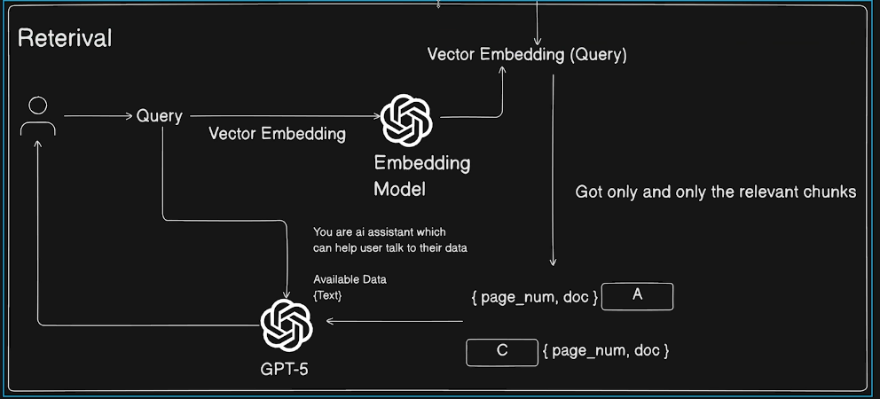

### Rag (Retrieval-Augmented Generation)

- **RAG** is a technique that combines retrieval-based and generation-based approaches to improve the quality of generated responses
- It involves retrieving relevant documents or information from a large corpus and using that information to inform the generation process
  

- RAG models typically consist of phases:

- **Phases Explained**:

  1.  **Indexing/Ingestion/Data Preparation/Extraction**: Prepare raw data (documents, PDFs, texts, etc.) for efficient search and retrieval.
      
      

      - **Chunking**: Split documents into smaller, manageable pieces (chunks) to facilitate retrieval.
      - **Embedding**: Convert chunks into vector representations using embedding models.
      - **Indexing**: Store the vector representations in a vector database for efficient similarity search.

2.  **Retrieval**: Fetch relevant context from the knowledge base in response to a user query.

    - **Query Embedding**: Convert the user query into a vector representation.
    - **Similarity Search**: Use the query vector to find the most relevant chunks in the vector database.
    - **Reranking**: Optionally rerank the retrieved chunks based on relevance to the query.

3.  **Generation**: Augment the original query with retrieved context to generate an accurate and relevant response.

    - **Merge Context**: Combine the retrieved chunks with the original query.
    - **LLM Inference**: Use a large language model to generate a response based on the augmented input.
    - **Post-processing**: Refine the generated response for clarity and coherence.

    
    | Phase      | Purpose                           | Main Steps                                 |
    | ---------- | --------------------------------- | ------------------------------------------ |
    | Ingestion  | Prepare data for retrieval        | Chunking, embedding, indexing              |
    | Retrieval  | Find relevant context for a query | Query embedding, similarity search, rerank |
    | Generation | Create final response             | Merge context, LLM inference, post-process |

**Summary:**
Ingest -> chunk -> embed-> store -> query -> retrieve -> rerank -> generate

to build this pipeline we can use libraries like Langchain, Haystack, etc.
and without using the library
